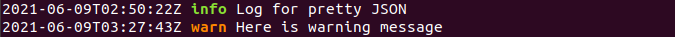
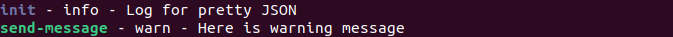

## munia-pretty-json

Convert the JSON log into readable form with command line.

### Installation

```sh
npm install -g munia-pretty-json
```

### Example

JSON log records (app-log.json):

```
{"time":"2021-06-09T02:50:22Z","level":"info","message":"Log for pretty JSON","module":"init","hostip":"192.168.0.138","pid":123}
{"time":"2021-06-09T03:27:43Z","level":"warn","message":"Here is warning message","module":"send-message","hostip":"192.168.0.138","pid":123}
```

Run the commond **munia-pretty-json** on shell:

```sh
$ munia-pretty-json app-log.json
```

This turns the JSON to:




With this tool the main feature is **template** that prettifies easily the JSON. Here is an example of template:

```sh
$ munia-pretty-json  --template  '{module --color} {level} {message}'  app-log.json<br> 
```




### Usage

<pre>
  Usage: munia-pretty-json [options] &lt;json-file&gt;
         tail -f &lt;json-file&gt; | munia-pretty-json [options]
         node myapp.js | munia-pretty-json [options]

  Options:

    -t, --template ..... template to format the json record
                         '{key [options]} {key [options]} {...}'
                         json property (key) names are used to format the template
                         default template '{time} {level --color} {message}'
    -C, --context ...... print number of lines before and after context
    -a, --all .......... print formatted json and non json records if true, default true
                         print only formatted json if false
    -d, --debug ........ print json parsing error message, default false
    -h, --help ......... help/usage infromation

  template options:

    -c, --color ........ color the values of this key, default false
    -i, --include ...... include records which match the value of key
    -e, --exclude ...... exclude records which match the value of key
    -f, --filter ....... regular expression to filter the records
    -w, --width ........ width of string to be printed
                         if negative then width is considered backward
    --level-key ........ log level key, default 'level',
                         effective only when used with --color option
                         it is useful to select defualt colors for levels

  template special options:

    -l, --level ........ level value, level upto which records to be included,
                         default 'info'
                         --level=info is equivenlent to --include=error,warn,info
                         Note: option only related to level key
    -t, --time ......... format the time key value from milli seconds to string
                         optional tokens can also be given to format the time
                         example: -t '[YYYYescape] YYYY-MM-DDTHH:mm:ssZ[Z]'
                         tokens as per dayjs https://day.js.org/docs/en/display/format
                         Note: option only related to time key

  Special keys:

    REST ............... print rest of the keys and values as a JSON string
                         (keys which are not part of the template)
                         example: -t '{level}: {message} {REST}'
    --include-keys ..... keys to include in 'REST'
                         example: -t '{msg} {REST --include-keys=app,pid}'
                         Note: option only related to 'REST' key
    --exclude-keys ..... keys to exclude from 'REST'
                         example: -t '{msg} {REST --exclude-keys=host,version}'
                         Note: option only related to 'REST' key
</pre>

## Testing
```shell
npm test
```
## License

Licensed under [MIT](./LICENSE).
